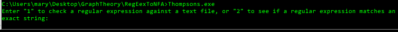
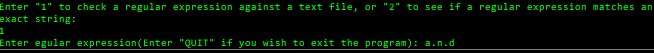
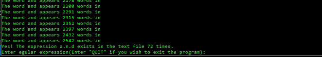
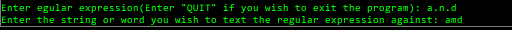
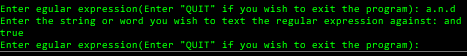

# RegEexToNFA
## Name: Gary Connelly.
## Student ID: G00336847
## Module: Graph Theory.
## Lecturer: Ian Mcloughlin.

This is the readme file that goes with my RegExToNFA project which I completed as part of my 3rd year module Graph Theory. This project is 50% of the overall grade for this module and it is my interpretation of how a basic regular expression engine could be constructed.

## Project Description:
3rd year project for the graph theory module(50%). Create a program that can turn a regular expression into postfix notation, and then into a non deterministic finite automota. This can then be tested against strings and return a boolean value for whether or not the regular expression matches the string.

## How to run the program:
If your machine does not already have Git and Go installed, they can be installed by going to 
 https://golang.org/dl/
 https://git-scm.com/downloads
 
 To clone the repository to your local machine, in command prompt enter
 ```
 https://github.com/garyconnelly1/RegEexToNFA
 ```
 ### Step 1:
Build the Thompsons.go file by typing the following into your command line.
```
go build Thompsons.go
```

### Step 2:
Execute the Thompsons.go file.
```
Thompsons.exe
```

## How to run the program:
In the command propt you should see the following message:



To check a regular expression against a text file press 1.
Enter the regular expression you wish to test(eg. a.n.d for a followed by n followed by d.)



As a result of this, you will recieve a message telling you whether or not that expression exists in the file, how many times it exists, and even where on the file it exists.



You can keep doing this as many times as you want, with whatever expressions you like. When you are done, simply type QUIT and the program will terminate.

If you type 2 in for the initial menu option, you will be asked to enter a regular expression and a string you would like to check the regukar expression against. 



This will return a true or false answer.




## How it was made.
### Resources:
I used a combination of resources to put this project together. First and foremost was learnonline. Our moodle page for graph theory was extremely well documented. It contained a lot of information about the theory behind deterministic finite automata and and non-deterministic finite automata. There was a series of lecture videos explaining in great detail, from the very beginning what an automata is and why it is important in the world of computing and computational thinking. - https://learnonline.gmit.ie/course/view.php?id=4161 .
It was also only the second project I have done in go so I had to reference the go documentation for a lot of the syntax around what I was trying to achieve. - https://golang.org/doc/ . 

### Features:
There are two main paths this program can take once it is run. The first option is to check the regular expression to see if it exists inside a text file. If it does exist, the program will tell them how many times it exists, and where in the file it exists.  I used the ioutil File Reader feature in go to achieve this.This loads the contents of the file into a string which I then split on the white spaces to create a string array of words. I then simple loop through this array and compare it to the regular expressions using counters to generate data about whats happening. This part of the program is in a loop, so you can keep passing it regular expressions for as long as you want. When you are satisfied, just enter "QUIT" into the command line and the program will end. The second path through the program is to see if a regular expression matches a string passed in by the user. This path of the program returns a boolean value for whether or not the regular expression is a match.

## Final thoughts.
It was a fascinating experience creating this program. Before this module, I was completely unaware of what automata were or how they worked. I now realise that they are a huge part of computer science and critical in understanding what make computers the powerful entities they are today. I have previously user regular expressions when making a chatbot last semester, but I now have a much better knowledge about the science that goes into regex engines, and how powerful they can be. I hope to build on this knowledge in the future as I think it is a very scalable asset to have going forward.
